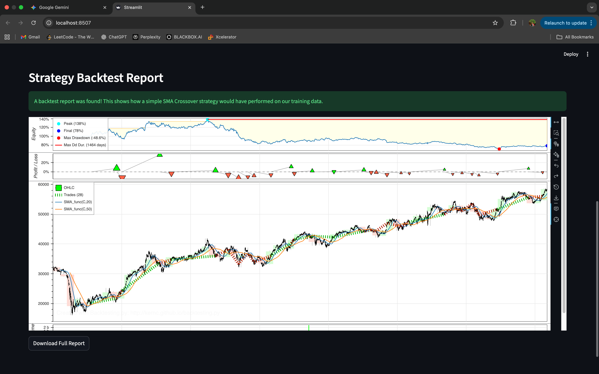
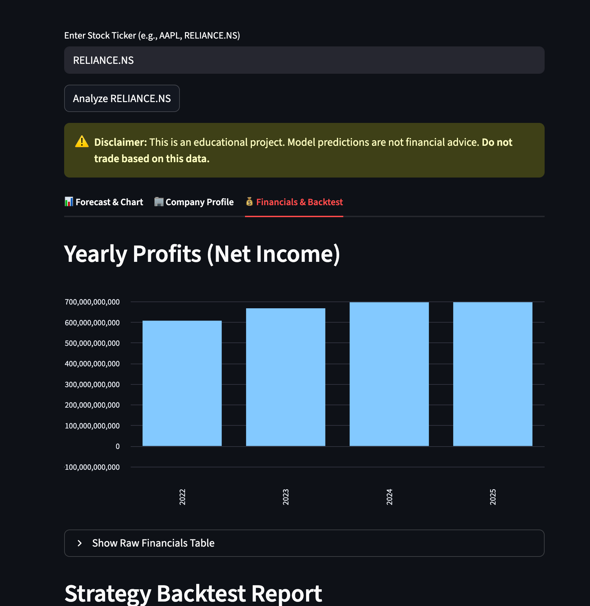
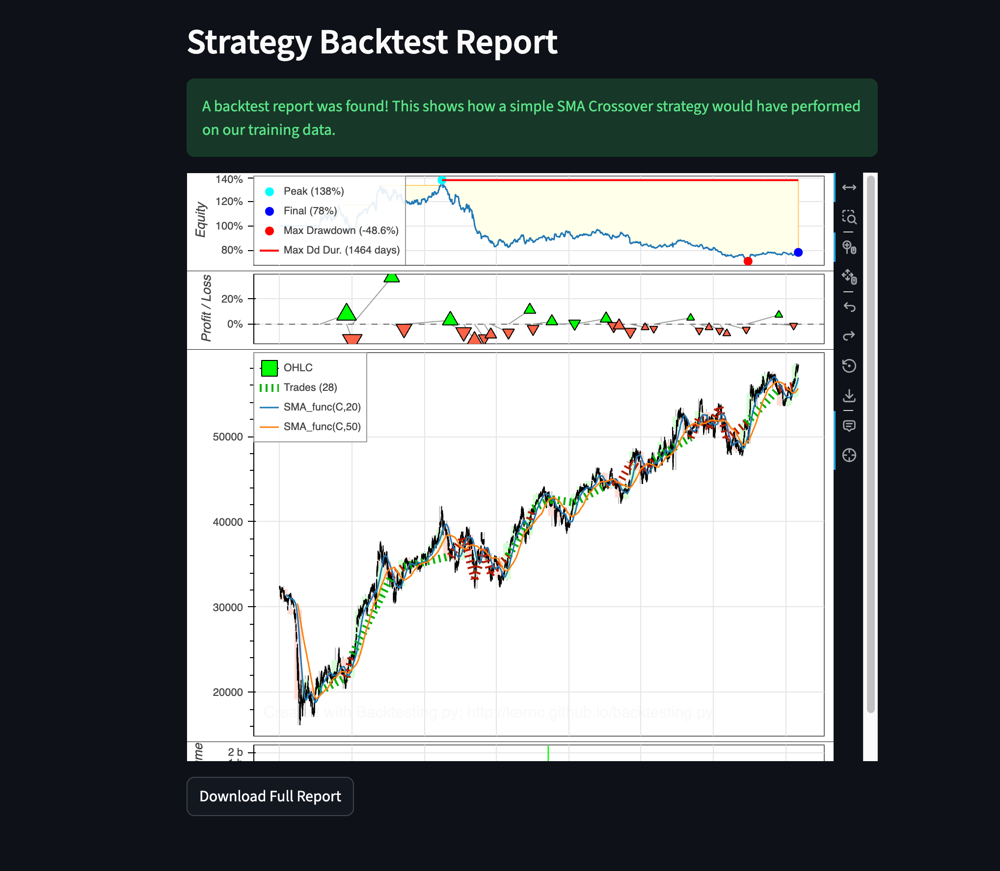

# 📈 Real-Time Stock Analysis & Forecast Dashboard..
This is a full-stack ML project that built an interactive web dashboard to analyze and forecast real-time stock data.

---

### Features

* **Real-Time Data:** Fetches live stock data (price, logo, company info) from Yahoo Finance (`yfinance`).
* **AI Price Prediction:** Uses a Keras/TensorFlow LSTM model to predict the next day's closing price.
* **News Sentiment Analysis:** Fetches live news from `NewsAPI` and uses `NLTK (VADER)` to analyze sentiment, feeding it to the model as a feature.
* **Professional UI:** Built with Streamlit, using `Plotly` for interactive "Groww-style" candlestick charts, profit charts, and visual gauges.
* **Strategy Backtesting:** Includes a "Financials & Backtest" tab that runs a simulation with `backtesting.py` to test a trading strategy's historical performance.

### How to Run This Project

1.  **Clone the repository:**
    ```bash
    git clone [https://github.com/Robash/StockDashboard.git](https://github.com/Robash/StockDashboard.git)
    cd StockDashboard
    ```

2.  **Create and activate a virtual environment:**
    ```bash
    python3 -m venv venv
    source venv/bin/activate
    ```

3.  **Install all required libraries:**
    ```bash
    pip install -r requirements.txt
    ```

4.  **Download the NLTK model:**
    ```bash
    python3 download_vader.py
    ```

5.  **Train the ML model:**
    (This will create the `price_model.keras` and scaler files)
    ```bash
    python3 train_price_model.py
    ```

6.  **Run the Backtest:**
    (This will create the `backtest_report.html` file)
    ```bash
    python3 backtest.py
    ```

7.  **Run the Streamlit App:**
    ```bash
    streamlit run app.py
    ```
### 🚀 Application Screenshots

**Main Forecast & Sentiment:**


**Company Profile & Key Stats:**


**Financials & Yearly Profits:**



